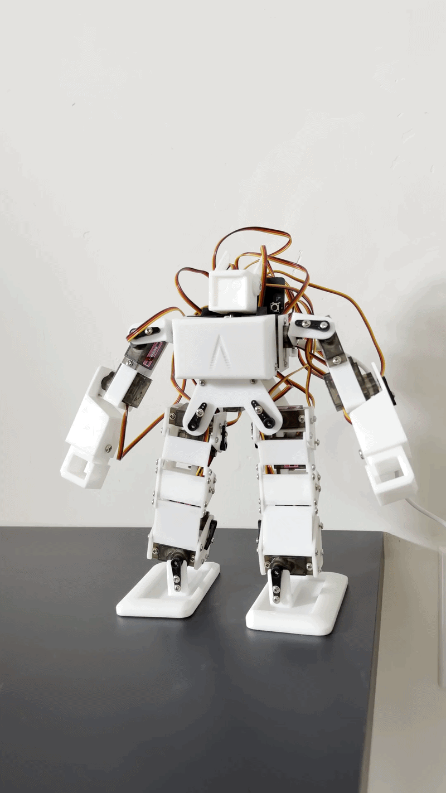

# AC-1

**A humanoid robot you build and control with the BBC Micro:bit.**

The AC-1 is a 16 servo humanoid robot kit. Students assemble it from scratch, then bring it to life with a Micro:bit. No coding required to get moving: flash the program, press a button, and the robot responds. When students are ready to go further, the full code is open to explore and change.

![AC-1 humanoid robot]

  

---

## Quick start

You can have the robot moving in a few minutes.

1. Download `microbit-Andbotics-demo.hex` from this repo.
2. Plug your Micro:bit into your computer with USB and drag `microbit-Andbotics-demo.hex` onto the MICROBIT drive to flash it.
3. Click the Micro:bit into the PCA9685 servo driver HAT.
4. Connect the separate servo power supply (see Hardware below). USB power alone is not enough to run the servos.
5. Press button **A**. The robot dances.

That is it. The robot is running.

---

## Button controls

| Press | What the robot does | Works on |
|-------|--------------------|----------|
| **A** | Dances | Micro:bit V1 and V2 |
| **B** | Waves | Micro:bit V1 and V2 |
| **Logo touch** | Does the splits | Micro:bit V2 only |

The logo touch sensor only exists on the Micro:bit V2, so the splits move needs a V2 board. Button A and button B work on any Micro:bit.

---

## What you need

**Hardware**
- BBC Micro:bit (V2 recommended; required for the logo touch splits move)
- PCA9685 servo driver HAT (the Micro:bit clicks directly into it)
- 16 MG90S 9g micro servos
- A separate servo power supply. The 16 servos draw far more current than the Micro:bit's USB connection can provide, so they need their own power. Powering from USB alone will cause the robot to behave erratically or not move at all.
- The assembled AC-1 chassis

**Software**
- The MakeCode editor for Micro:bit: https://makecode.microbit.org
- The **PCA9685** servo driver extension, added inside MakeCode

> **Adding the extension:** In MakeCode, open the project, click the gear menu, choose **Extensions**, and search for **PCA9685**.

---

## Servo map

Every joint has a numbered channel on the driver board. Use this map when assembling and when plugging servos in. Plugging a servo into the wrong channel will move the wrong joint, so double check against this diagram before powering on.

| Channel | Joint |
|---------|-------|
| 1 | Right ankle |
| 2 to 4 | Right leg |
| 5, 6, 7 | Right arm |
| 8 | Waist |
| 9 | Head |
| 10, 11, 12 | Left arm |
| 13 to 15 | Left leg |
| 16 | Left ankle |

---

## Calibration and safety

- **Center the servos before assembly.** Run the centering routine and attach each servo horn at its neutral position so joints have a full, even range of motion.
- **Do not force joints by hand** when the robot is powered. You can strip a servo gear.
- **Respect the angle limits** in the code. Sending a joint past its mechanical limit can damage the servo or the chassis.
- The splits move puts real load on the hip and leg servos. Test it on your own robot before relying on it in a demo.

---

## For the curious: the code

The program is open and meant to be explored. Each button press maps to a movement routine that sends a sequence of angles to the servo channels through the PCA9685 driver.

To change what the robot does:
1. Open the project in MakeCode at [https://makecode.microbit.org](https://makecode.microbit.org/S50700-18709-77911-65868)
2. Find the `on button A pressed` (and B, and logo) handlers.
3. Edit the movement routines, or build your own and assign them to a button.

This is a natural first programming project: students can start by tweaking an existing wave, then build an entirely new move and bind it to a button.

> **Status:** The dance, wave, and splits routines are demo ready. Walking gait development is in progress and not yet included as a button action.

---

## Troubleshooting

| Problem | Likely cause |
|---------|-------------|
| Servos jitter or twitch | Servo power supply is underpowered or not connected. Servos cannot run on USB power alone. |
| Nothing moves at all | The PCA9685 board is not detected. Check it is seated and that the PCA9685 extension is added in MakeCode. |
| The wrong joint moves | A servo is plugged into the wrong channel. Check it against the servo map. |
| Splits does nothing | You are on a Micro:bit V1. The logo touch sensor is V2 only. |
| Micro:bit will not flash | Re-drag `microbit-Andbotics-demo.hex` onto the MICROBIT drive, or try a different USB cable (some are charge-only). |

---

## License

© 2026 Andbotics. All rights reserved.

AC-1 and Andbotics are trademarks of Andbotics.

---

## About

Built by Andbotics. Learn more at [andbotics.com](https://andbotics.com).

Questions about the AC-1 or running a pilot program? info@andbotics.com
